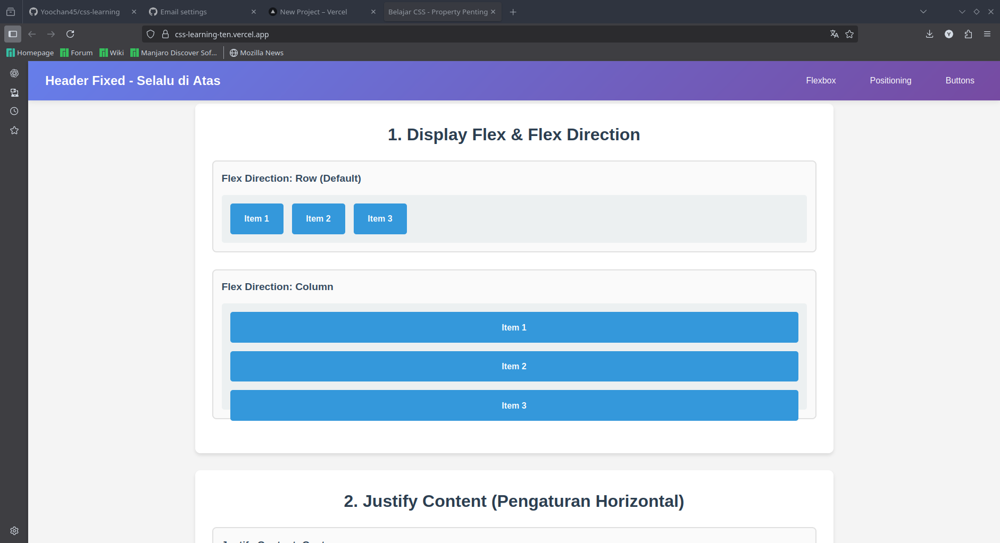
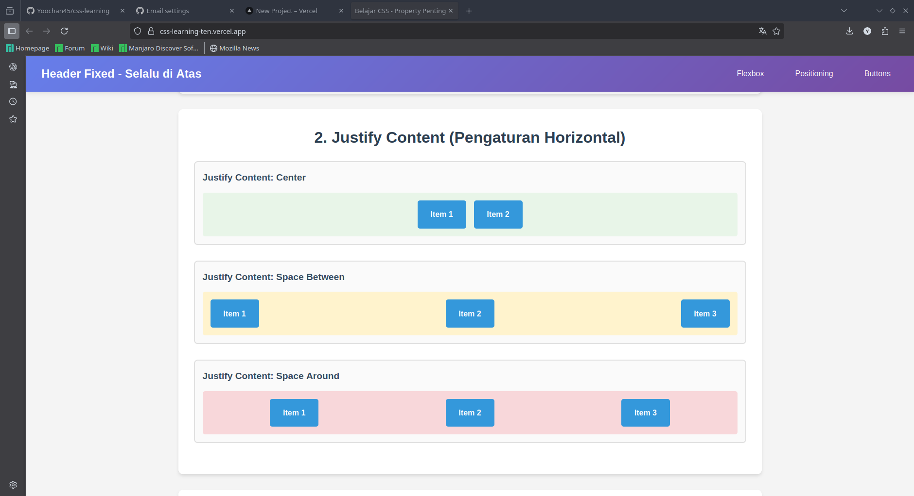
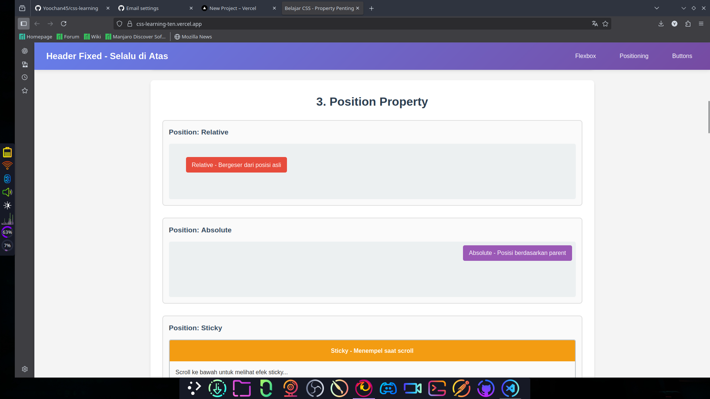
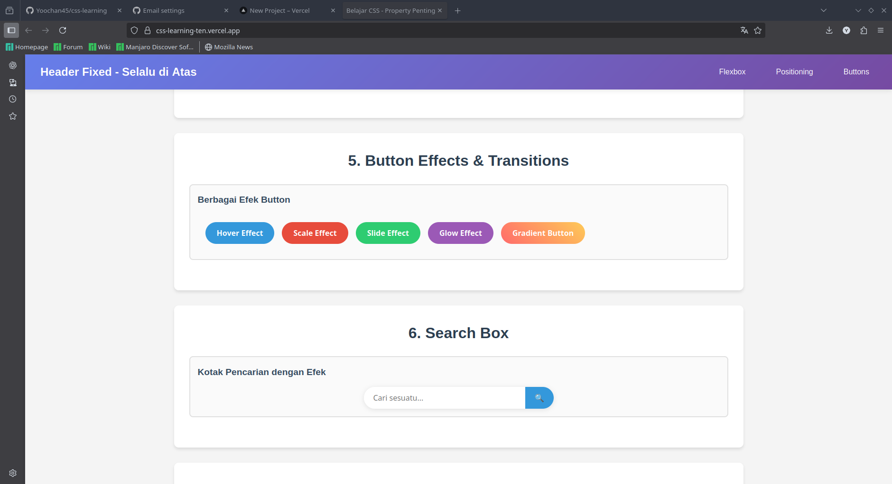
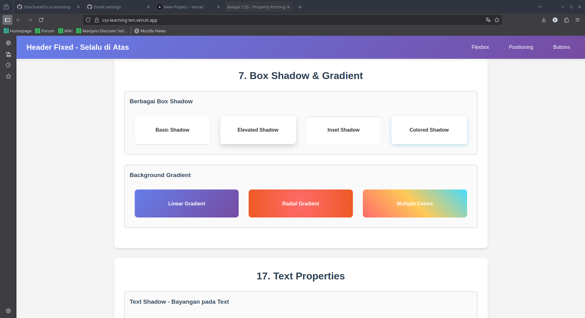
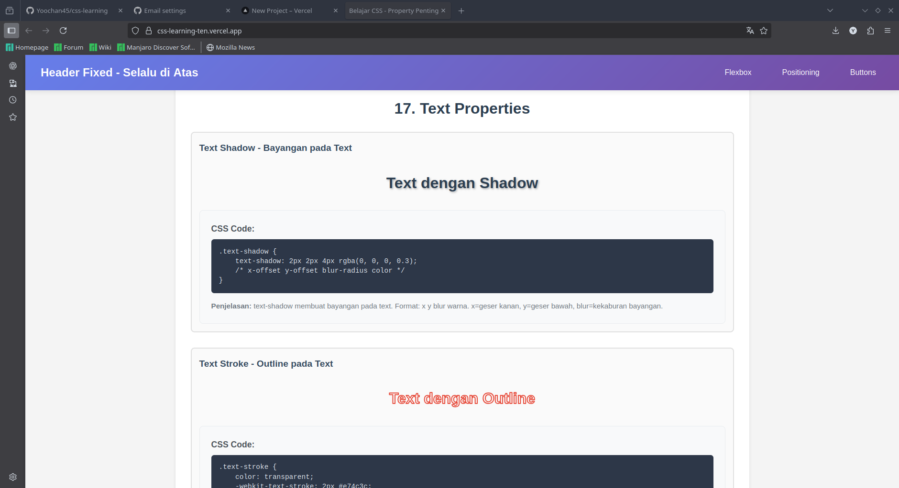
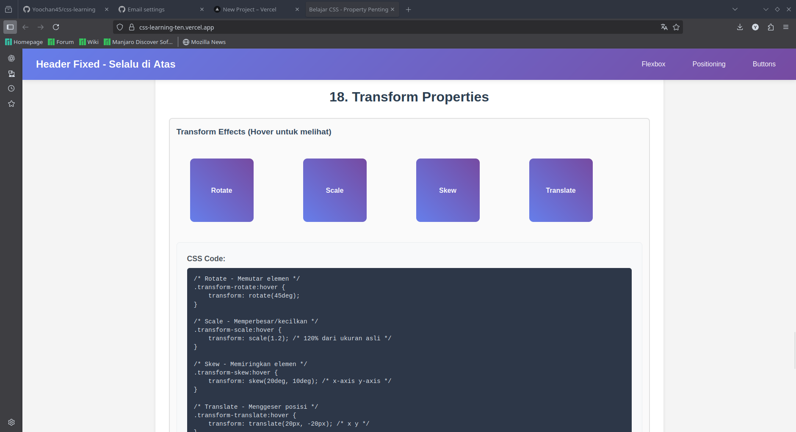
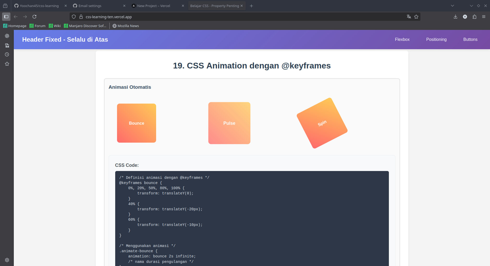

# 🎨 CSS Learning Hub

Website pembelajaran CSS interaktif yang lengkap dengan contoh visual dan penjelasan kode untuk menguasai property CSS penting.

## ✨ Features

- **19+ CSS Properties** dengan contoh interaktif
- **Live Code Examples** dengan syntax highlighting
- **Visual Demonstrations** untuk setiap property
- **Responsive Design** untuk semua device
- **Detailed Explanations** dalam bahasa Indonesia

## 🚀 What You'll Learn

### Basic Properties
- Flexbox & Flex Direction
- Justify Content & Align Items
- Position (Fixed, Absolute, Relative, Sticky)
- Multiple Container Layouts
- Button Effects & Transitions

### Advanced Properties
- Text Effects (Shadow, Stroke, Gradient)
- Transform Properties (Rotate, Scale, Skew)
- CSS Animations with @keyframes
- Box Shadow & Gradients
- Overflow, Clip-path, Filter Effects
- CSS Variables & Custom Properties

## 🛠️ Technologies Used

- HTML5
- CSS3
- Vanilla JavaScript (minimal)
- Responsive Design

## 📱 Live Demo

[View Live Demo](https://css-learning-ten.vercel.app/)

## 🎯 Perfect For

- CSS beginners learning fundamentals
- Developers wanting quick reference
- Students practicing web design
- Anyone building modern websites

## 📄 License
feel free to use for learning!

